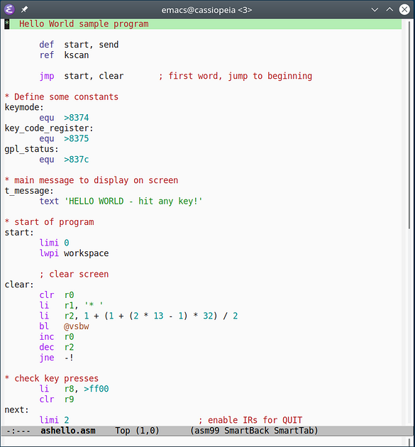
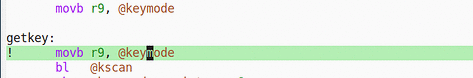
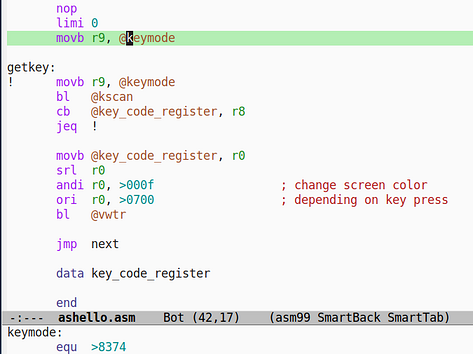
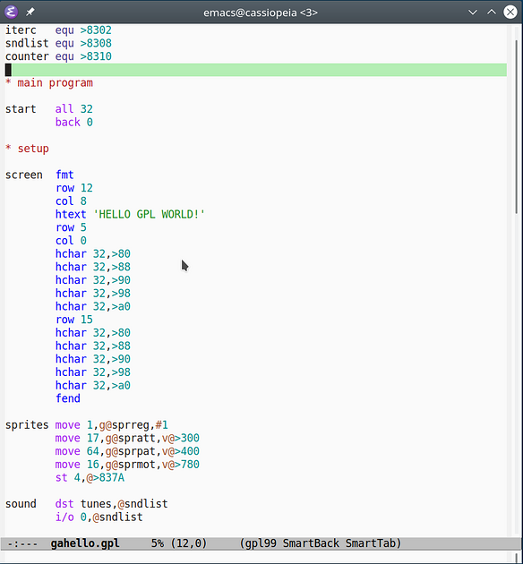
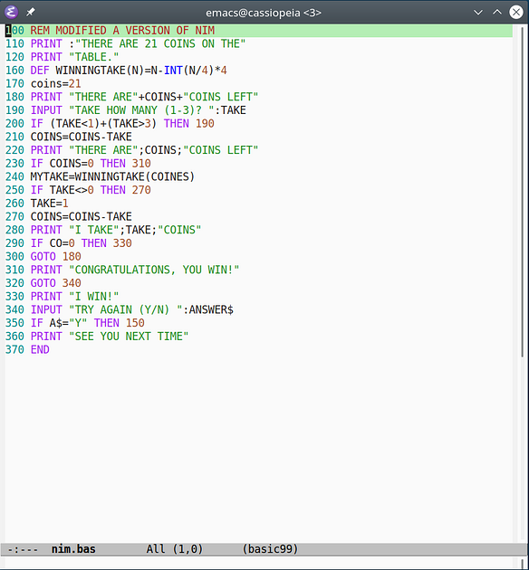
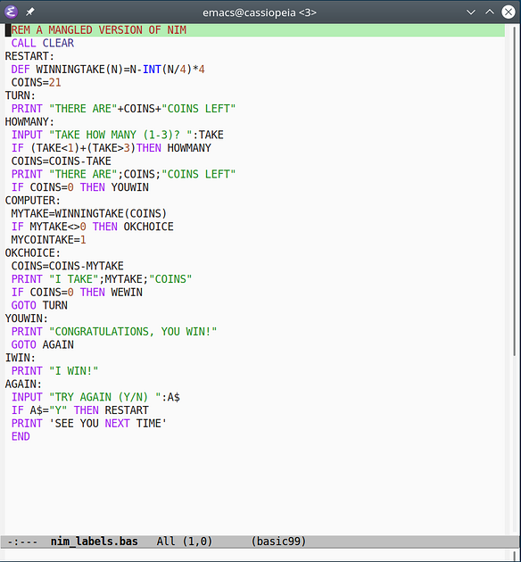

xdt99-Mode For GNU Emacs
========================

The Emacs library `xdt99-mode` provides three major modes for editing assembly,
GPL and TI Extended BASIC programs.  The assembly mode offers syntax
highlighting and editing assistance, while the BASIC mode is currently limited
to syntax highlighting.

The xdt99 library currently supports all instructions supported by xdt99
version 3.3.

Please note that stock Emacs uses relatively simple technology for analyzing
source code, so the level of functionality that `xdt99-mode` can offer is
limited.  For advanced features such as semantic assistence please use the
IntelliJ IDEA plugin instead.

Assembly Programs
-----------------

Assembly support is provided by the `asm99-mode` major mode.  To activate this
mode, press `M-x` (i.e., press the meta key plus the `X` key) and enter
`asm99-mode` at the prompt.  Please refer to the installation section on how to
automate this step.

`asm99-mode` highlights known TMS9900 and related mnemonics as well as various
assembly constructs such as registers and strings.  The look and feel of the
highlighting can be customized using the Emacs `font-lock` faces.

Please note that library, unlike the IDEA plugin, cannot perform syntax checks.

The `asm99-goto-def` command will jump to the location of the label that the
cursor is currently positioned on.

The `asm99-show-def` command will show the label definition in the mini buffer.
For easy navigation it is recommended to assign these commands to some shortcut
keys of your choice (see below).

The `comment-region` command (typically bound to `C-c ;`) adds the `xas99`
comment character `;` to a range of lines.  Conversely, the `uncomment-region`
command removes a single `;` character from each line.

Two minor modes provide support for formatting assistance.  The
`asm99-smart-tab-mode` minor mode will

 * automatically indent the current line based on the left-most character or
   word, and
 * advance the cursor to the next tab stop position, i.e., label, mnemonic,
   argument, or comment field,

whenever the user hits the `Tab` key.  You may edit the Emacs variable
`tab-stop-list` to adjust the tab stop positions to your liking.  If
`electric-indent-mode` mode is active, pressing `Return` will also indent the
line just entered.

The `asm99-smart-backspace-mode` minor mode will move the cursor back to the
previous tab stop if there is only whitespace between the cursor and the tab
stop.  In other words, the `Backspace` key acts as the inverse of the `Tab` key.

Both minor modes are active for `asm99-mode` by default but may be toggled by
`M-x asm99-smart-tab-mode` or `M-x asm99-smart-backspace-mode`, respectively.

GPL Programs
------------

GPL support is provided by the `gpl99-mode` major mode.

The GPL mode `gpl99-mode` is very similar to the Assembly mode and use the
corresponding functions `xga99-goto-def`, `xga99-show-def`.

Because of the large similarities between GPL and assembly, `gpl99-mode` reuses
the settings for Smart Tab and Smart Backspace.

TI BASIC and TI Extended BASIC Programs
---------------------------------------

TI (Extended) BASIC support is provided by the `basic99-mode` major mode.  To
activate this mode, press `M-x` and enter `basic99-mode`.  Please refer to the
installation section on how to automate this step.

`basic99-mode` highlights known TI Extended BASIC keywords and various BASIC
constructs such as line numbers and strings.  The look and feel of the
highlighting can be customized using the Emacs `font-lock` faces.

`basic99-mode` also supports BASIC programs with labels instead of line numbers.

There is currently no additional editor assistance for TI Extended BASIC beyond
the built-in Emacs functionality.  It is also not possible to restrict the
`basic99-mode` to TI BASIC only.

Installation
------------

Emacs is configured by creating a `.emacs` file in your home directory.  For
Windows-specific information about the home directory, please refer to the
relevant [GNU FAQ item][5].

Extensions are generally placed into the Emacs `site-lisp` directory or into
your local `.emacs.d` directory.  When using a non-standard directory, you need
to add its location to your library path in your `.emacs` config file, e.g.,

    (add-to-list 'load-path "~/.emacs.d/")

To activate the xdt99 extension for Emacs, add

    (autoload 'asm99-mode "xdt99-mode" "TMS9900 Assembly Mode" t)
    (autoload 'gpl99-mode "xdt99-mode" "GPL Mode" t)
    (autoload 'basic99-mode "xdt99-mode" "TI Extended BASIC Mode" t)

to your `.emacs` file.

The xdt99 Emacs library has been tested with Emacs 24, but newer or reasonably
older versions of Emacs should also work.

Customization
-------------

You can associate arbitrary file extensions to the major modes provided by
xdt99:

    (setq auto-mode-alist
      (append '(("\\.a99$" . asm99-mode)    ; .a99 -> assembly
                ("\\.asm$" . asm99-mode)    ; .asm -> assembly
                ("\\.gpl$" . gpl99-mode)    ; .gpl -> GPL
                ("\\.b99$" . basic99-mode)  ; .b99 -> TI BASIC
                ("\\.bas$" . basic99-mode)  ; .bas -> TI BASIC
                ("\\.xb$" . basic99-mode)   ; .xb  -> TI BASIC
               ) auto-mode-alist))

Alternatively you can use `M-x asm99-mode`, `M-x gpl99-mode`, and
`M-x basic99-mode` to activate or deactivate each mode for the active buffer.

It is recommended to use `electric-indent-mode` with smart tabs, but it may not
be enabled by default.  To use `electric-indent-mode`, add

    (electric-indent-mode 1)

To permanently disable the smart tab and/or smart backspace minor modes, add one
or both of these lines to your `.emacs` file:

    (asm99-smart-tab-mode 0)
    (asm99-smart-backspace-mode 0)

You can always use `M-x asm99-smart-tab-mode` and `M-x
asm99-smart-backspace-mode` to activate or deactivate each minor mode for the
active buffer.

For easy navigation you may assign label navigation to some convenient key
shortcut:

    (global-set-key [f3] 'asm99-goto-def)
    (global-set-key [S-f3] 'asm99-show-def)

These lines assign functions `asm99-goto-def` and `asm-show-def` to the `F3` and
`Shift-F3` keys, respectively.
