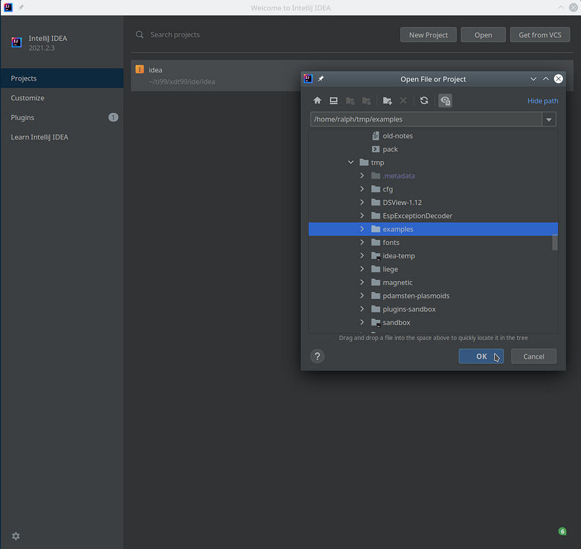

xdt99 IDEA Plugin
=================

The _xdt99 IDEA plugin_ version 3.3 makes the IntelliJ IDEA IDE's advanced code
assistance functionality available to TMS99xx assembly programs, GPL assembly
programs, and TI BASIC and TI Extended BASIC programs.

Unlike the pattern-based Emacs mode, this plugin knows the rules of TMS99xx
assembly and GPL assembly and thus can highlight all errors that would cause the
`xas99` or `xga99` assembler to issue errors.  For TI BASIC and TI Extended
BASIC, only some errors are detected.

Setting up IntelliJ IDEA
------------------------

The plugin should work in most Jetbrains IDEs, including the free community
versions of IntelliJ IDEA and PyCharm.  If you don't already have any specific
Jetbrains IDE installed, we recommend using [IntelliJ IDEA][1].

The plugin was developed with IntelliJ IDEA version 2021.2.3, but all versions
from 2020.3 upwards should work.  For older versions, we recommend the previous
version 1.1 of the plugin.

Starting IntelliJ IDEA (or IDEA, for short) for the first time, we are greeted
with the project selection window.

As part of the installation process, we then have to install the xdt99 IDEA
plugin by selecting _Plugins_ in the left pane of the window.  After clicking
the gear symbol on top, we choose _Install from file ..._ and then select our
plugin ZIP file.

Restarting the IDE will activate the plugin.

IDEA offers various so-called _keymaps_ that define which keys we have to press
to perform certain functions.  To follow this manual, we recommend using the
Eclipse keymap by clicking _Customize_ and then selecting `Eclipse` in the
_Keymap_ drop down list.  Users familiar with Jetbrains IDEs can keep their
usual keymap, of course.

Creating a Project
------------------

To create a new empty project or a project with already existing sources, we
click the _Open ..._ button and then choose the directory where are sources
should be or already are.

**IMPORTANT!** Do not use the _New Project_ button.

If we opened projects in the past, their list will appear in this window as
shortcuts.  Clicking on one of the listed projects will open it.

For this tutorial, we select the `examples/` directory of the xdt99 release,
where we modified some files for instruction purposes.  After the project has
been created, IDEA shows the project view.

The left pane lists all the files contained in the project, i.e., in the project
directory.  Each xdt99 file has an icon attached to it that denotes the type of
that file:

  -  Assembly (normal and strict syntax)
  -  Assembly (relaxed syntax)
  -  GPL (normal and strict syntax)
  -  GPL (relaxed syntax)
  -  TI Extended BASIC
  -  TI Extended BASIC (using labels)

For each language, there are two different file types available: normal/strict
syntax and relaxed syntax for assembly and GPL, and line numbers and labels for
BASIC.  To learn about _relaxed syntax_ or _BASIC with labels_, please refer to
the [xdt99 manual][2].

Since the same extensions are attached to both variants of each language, the
IDE randomly chooses either file type when creating a new project or adding new
files to an existing project.  To change the assigned file type of a given file,
we right-click on that file in the left pane and select `Override file type
...`.

Unfortunately, the shown list of available file types is very long, and we have
to scroll right to the end, where we see the six xdt99 file types: `Xas99` for
assembly, `Xas99R` for assembly with relaxed syntax, `Xga99` for GPL, `Xga99R`
for GPL with relaxed syntax, `Xbas99` for BASIC with line numbers, and `Xbas99L`
for BASIC with labels.

All chosen file types are saved in the project, so we have to do this
reassignment only once.

If we want to switch projects, we first need to close the current project by
selecting _File - Close Project_ from the menu.  After this, the project
selection window is shown again.

Assembly and GPL programs
-------------------------

Since the IDEA plugin features for TMS99xx assembly and GPL assembly are very
similar, we will discuss both languages and all four variants together,
referring to all of them as _assembly_.

In general, the plugin supports the entire instruction set of `xas99` and
`xga99`, with the exception of syntax variants for `xga99`.

If we double-click on a file in the left pane, we will see its contents in the
right pane.  The most obvious feature of the plugin then is _syntax
highlighting_, which colors certain parts of a given program differently.

Also, syntax errors are marked by red squiggles, similar to those found in
common word processors.

The complete list of markings that provide information about errors and warnings
is shown here:

  -  Squiggles denote syntax errors, such as bad
    operands, incorrect expressions, or erroneous spaces.
  -  Red text highlight other errors, such as
    undefined symbols.
  -  Grey labels represent unused labels.
  -  A color background
    highlights other warnings or errors, e.g., an undefined target for a local
    label

Hovering over any mark for errors or warnings provides additional information on
why this part of the code has been flagged.

Please note that `COPY`ed files that are not included in the project, e.g.,
standard xdt99 library files, will not be processed, and symbols referring to
definitions in such external files are shown as undefined, as in the example
above.  To resolve external symbols, simply copy the those external files to the
project directory.

Symbols imported with a `REF` directive are defined, but further information
about such external symbols will not be available.

Syntax highlighting supports both light mode and dark mode, which may be
activated in _File - Settings - Appearance - Theme_.

Individual colors might be changed in _File - Settings - Color Settings_ and
then one of the file types.

The semantic analysis of the IDEA plugin is not limited to syntax highlighting,
though.  If we place the cursor on any of the symbols in the code, we see that
all occurrences of that symbol will be highlighted.

It is worth pointing out that symbols are not identified by a simple search.
Internally, IDEA builds a semantic model of the program, which tells it exactly
what each part of the program, such as a symbol, represents.  We can best see
this if we keep the cursor on this symbol and then press `Shift+F6`, which
initiates _inline renaming_ mode.

As we keep changing the symbol name, all other occurrences of that symbol, and
only those, are safely modified in sync.  Safe renaming refers to the fact that
inline renaming does not affect strings, comments, or other symbols that merely
contain a part of the renamed symbol,

Another very useful feature of this semantic understanding is locating the
definition of any symbol, where definition here means the location of the symbol
as label.  Placing the cursor on any label, pressing `F3` or selecting
_Navigate - Declaration_ will jump from our original position to the definition
of the symbol as label.

Conversely, we can navigate the other direction by pressing `Ctrl+G` or
selecting _Edit - Find - Find Usages_ to find all usages of the symbol
definition under the cursor in our code.

We can examine the list of usages in the bottom pane and jump to any find by
double clicking.

To go back to our previous position, we press `Alt+←`, which works in any
context.  We can also close the usages pane by clicking `—` in the top right
corner of the usages pane.

If we want to know the definition of a symbol but don't want to leave our
current position in the file, we can hover the mouse pointer over that symbol,
and a popup with the definition will appear.

The popup also contains any comments directly preceding the definition, which
might be comments provided additional information about the symbol.

And finally, if we do not remember which symbol we need to use at a given point
in our program, we might write partial prefix and then press `Ctrl+Space` to
invoke _code completion_.

If there is only one possible completion, it will be automatically inserted into
the program.

Code completion even suggests symbols when simply typing the start of a symbol,
i.e., without explicitly invoking code completion.  Again, if only one possible
completion exists, it will be automatically inserted.

Symbols are tracked across all source files of a given file type within the
project.  If we have split our program into multiple files -- be it for using
the `COPY` directive or for linking several files together -- we can still
navigate between files and rename symbols consistently.

**IMPORTANT!** It is recommended that for each file type, each project contains
only files that belong to the same source unit.

In the left margin of our code we see line numbers and _ranges_, denoted by a
thin line that ends in small `-` symbols.  If we click on either `-`, the
corresponding range is _collapsed_ so that only the first line of that range
remain visible, and a `+` symbol replaces the `-` symbols.

Each range extends from a group of line comments to the start of the next group
of line comments, including the start and the end of the source, resp.  The idea
is that each important section of a program is introduced by a line comment
explaining that section.  During development, we can hide irrelevant code
sections by collapsing their ranges, e.g., to move two separate parts of the
code together on the screen.

When typing a program in IDEA, pressing `Tab` will automatically move the cursor
to the next field.  Likewise, pressing `Backspace` will move the cursor to the
previous field or the end of existing text, whichever is reached first.
Pressing `Enter` will move the cursor to the mnemonic field in the next line.
To move the cursor to the label field, we can press `Home`-

**IMPORTANT!** When observing a different behavior, we recommend to check and
experiment with the _Editor - General - Smart Keys_ settings, in particular
_Enter - Smart Indent_ and _Backspace_.

If we type a _paired character_ such as `(`, `'`, or `"`, the other character of
that pair, i.e., `)`, `'`, or `"`, is automatically inserted.

In this example, we only typed the first `'` character, and the second one was
automatically inserted for us.

We can then normally type the rest of the expression or string.  If we type the
closing `)`, `'`, or `"`, no new character is inserted, but the cursor advances
over the already present character.  Also, when we position the cursor over such
a paired character, the other character is highlighted.

Selecting a few lines of our code and pressing `Ctrl+/` or selecting _Code -
Comment with line comment_, we can _comment_ and uncomment the selected lines
with `;`.

If no lines are selected, the current line is commented or uncommented.

In case we are a rather sloppy developer writing more or less messy programs, we
can easily get help to tidy up our code by pressing `Ctrl+Alt+L` or selecting
_Code - Reformat Code_.

The exact rules, in particular the starting positions of each field, the
character case, and possibly the syntax variant (normal or strict, i.e., one or
none spaces), can be configured in _File - Settings - Code Style - (xdt99
language)_.

**IMPORTANT!** Should at any time any of the above feature stop working, we
recommend to rebuild the index by choosing _File - Invalidate Caches_ from the
menu.

TI BASIC and TI Extended BASIC
------------------------------

The xdt99 IDEA plugin supports both line-based and label-based variants of TI
BASIC and TI Extended BASIC (or _BASIC_, for short).  The label-based syntax is
a special syntax provided by the `xbas99` tool.

### BASIC with line numbers

The syntax highlighter colors different parts of BASIC programs according to
their meaning.

The highlighter also marks the following errors and warnings:

  -  Squiggles denote basic syntax errors and
    string/number mismatches
  -  Red text highlights other errors, such as
    variables that are never written to (and thus potentially misspelled), or TI
    Extended BASIC constructs used in a TI BASIC program
  - Grey variables are variables that are 
    never read (and thus useless)

Hovering over any mark for errors or warnings provides additional information on
why this part of the code has been flagged.

The plugin understands most of the TI BASIC and TI Extended BASIC syntax and
reports many syntax errors, but it does not implement the complete BASIC
grammar.  As such, syntactically correct but nonsensical statements such as

    10 CALL CLEAR(1):: CALL HCHAR(#1,"A"):: OPTION BASE 99

are not flagged.

What symbols are for assembly support, line numbers and variables are the BASIC
units for which navigation and renaming is supported.

Placing the cursor on any line number

or variable

highlights all occurrences within the current BASIC program.

Similarly, pressing `Shift+F6` activates _inline renaming_, which will safely
rename all instances of the currently selected line number or variable, without
affecting numbers, strings, or comments.

Similarly, with the cursor on any line number or variable, pressing `Ctrl+B` or
selecting _Navigate - Declaration_ from the menu will navigate to the
_definition_ of that line number or variable.

In case of a line number, definitions refers to the line with that line number,
and in case of a variable, definition refers the first occurrence where that
variable is written to.

Conversely, pressing `Ctrl+Alt+B` or selecting _Edit - Find - Find Usages_ will
list all occurrences where the current line number or variable is used -- in
case of a variable that includes both reading and writing instances.

Mouse hovers aren't supported for BASIC, as the "definition" of either line
number or variable doesn't really provide any useful context information.

If we are writing a BASIC program and we are unsure which variable we need to
use at a certain point, we can press `Ctrl+Space` to invoke _code completion_ to
get a list of possible variables with a given prefix.

Unfortunately, there is one particular quirk for completing string variables.
When completion a string variable we not only have to specify a prefix, but we
also have to type a string symbol `$` right after the cursor.

This special handling wouldn't be necessary if the `$` symbol were at the
_beginning_ of a string variable, but as it isn't, we'll have to live with that
quirk.

When we type a partial variable name, code completion is automatically invoked
and suggests possible completions or, if there is only one completion,
automatically inserts the completion.  Sadly, this also doesn't work for string
variables.

Obviously, code completion makes no sense for line numbers.

**IMPORTANT!** Unlike assembly labels, BASIC line numbers and variables are
tracked for each file individually.  Thus, we can have many different BASIC
programs independently within one project.

Writing BASIC programs is straight-forward, so no special handling for `Tab`,
`Enter`, or `Backspace` is offered.

If we type a _paired character_ such as `(` or `"`, the other character of that
pair, i.e., `)` or `"`, is automatically inserted.

We can then normally type the rest of the expression or string.  If we type the
closing `)` or `"`, no new character is inserted, but the cursor advances over
the already present character.  Also, when we position the cursor over such a
paired character, the other character is highlighted.

In case we are a rather sloppy developer writing more or less messy programs, we
can easily get help to tidy up our code by pressing `Ctrl+Alt+L` or selecting
_Code - Reformat Code_.

The only available formatting settings for BASIC concerns the character case.

The other available code style setting controls whether the programs in the
project are TI BASIC programs or TI Extended BASIC programs.

If the TI Extended BASIC option is unchecked, all TI Extended BASIC constructs
used in the programs are flagged as errors.  Note that after changing this
setting, we might need a minor edit before the updated highlighting of the code
takes effect.

**IMPORTANT!** Should at any time any of the above feature stop working, we
recommend to rebuild the index by choosing _File - Invalidate Caches_ from the
menu.

### BASIC with Labels

BASIC with labels is identical to regular BASIC with line numbers, but replaces
line numbers with labels.

There is no native support for BASIC with labels on the TI 99/4A, but the
`xbas99` tool converts BASIC with labels into a regular BASIC programs.

The IDEA plugin offers the same features for BASIC with labels as for BASIC with
line numbers.

In addition, code completion for labels and marking unused labels is supported.

Contact Information
-------------------

The xdt99 IDEA plugin is part of the [TI 99 Cross-Development Tools][2].  The
tools are released under the GNU GPL, in the hope that TI 99 enthusiasts may
find them useful.

Please email feedback and bug reports to the developer at <r@ti99.pro>, or use
the issue tracker on the project [GitHub page][3].

[1]: https://www.jetbrains.com/idea
[2]: https://endlos99.github.io/xdt99
[3]: https://github.com/endlos99/xdt99
